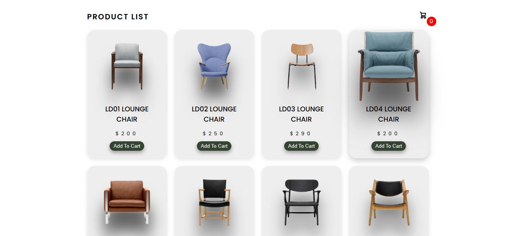
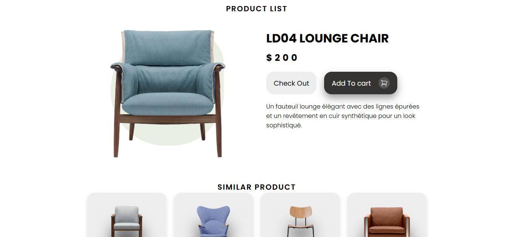
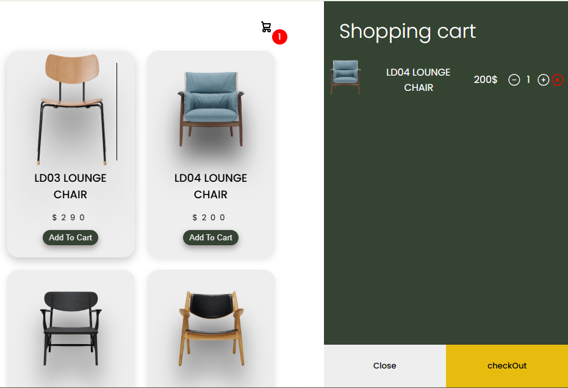

# 🛋️ Modern Furniture Product Showcase

A clean and responsive **furniture e-commerce UI** built entirely with **HTML, CSS, and JavaScript**.  
This project showcases a collection of elegant lounge chairs with interactive product cards, dynamic cart functionality, and a modern, minimalist design.

---

## 🚀 Features

- 🪑 **Product Listing Page** – Displays multiple lounge chairs with images, names, and prices.  
- 🛒 **Add to Cart Functionality** – Add items to the cart and see the cart count update instantly.  
- 🔍 **Product Detail Page** – View product details with checkout and add-to-cart buttons.  
- 💎 **Responsive Design** – Optimized for desktop and mobile screens.  
- ✨ **Pure Front-End** – Built with only HTML, CSS, and vanilla JavaScript.

---

## 🧰 Technologies Used

- **HTML5** – Structure and layout  
- **CSS3** – Styling and responsive grid design  
- **JavaScript (ES6)** – DOM manipulation and cart logic  

---

## 📁 Folder Structure### 🏷️ Product List Page

### 🪑 Product Detail Page

### 🪑 Product Cart 

